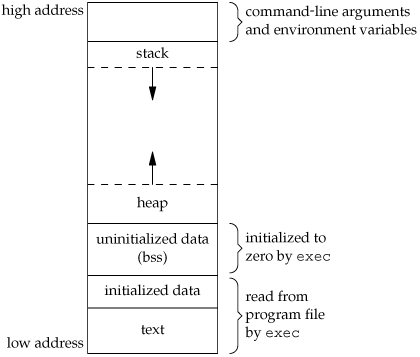

# Memory

The memory is structured as following:



- The stack grows downwards into lower addresses (into .bss direction)
- The heap grows into higher addresses and is dynamically allocated during runtime. It is whatever is free between the stack and .bss


## ELF files

The binary files are elf-files (Executable and Linkable Format).
To further investigate the binary files the `readelf` CLI is useful.

```txt
$ readelf --file-header ./hello

ELF Header:
  Magic:   7f 45 4c 46 02 01 01 00 00 00 00 00 00 00 00 00
  Class:                             ELF64
  Data:                              2's complement, little endian
  Version:                           1 (current)
  OS/ABI:                            UNIX - System V
  ABI Version:                       0
  Type:                              EXEC (Executable file)
  Machine:                           Advanced Micro Devices X86-64
  Version:                           0x1
  Entry point address:               0x401040
  Start of program headers:          64 (bytes into file)
  Start of section headers:          15184 (bytes into file)
  Flags:                             0x0
  Size of this header:               64 (bytes)
  Size of program headers:           56 (bytes)
  Number of program headers:         11
  Size of section headers:           64 (bytes)
  Number of section headers:         36
  Section header string table index: 35
```


This shows how the program is loaded in memory (with the beginning on the bottom).
```txt
$ readelf --symbols ./hello

   Num:    Value          Size Type    Bind   Vis      Ndx Name
    63: 0000000000404060     0 NOTYPE  GLOBAL DEFAULT   24 _end
    37: 0000000000404058     1 OBJECT  LOCAL  DEFAULT   24 completed.8061
    24: 0000000000404058     0 SECTION LOCAL  DEFAULT   24
    68: 0000000000404058     0 OBJECT  GLOBAL HIDDEN    23 __TMC_END__
    66: 0000000000404055     0 NOTYPE  GLOBAL DEFAULT   24 __bss_start
    54: 0000000000404055     0 NOTYPE  GLOBAL DEFAULT   23 _edata
    43: 000000000040403d     1 OBJECT  LOCAL  DEFAULT   23 fmtstr
    42: 0000000000404030     1 OBJECT  LOCAL  DEFAULT   23 msg
    60: 0000000000404028     0 OBJECT  GLOBAL HIDDEN    23 __dso_handle
    23: 0000000000404020     0 SECTION LOCAL  DEFAULT   23
    53: 0000000000404020     0 NOTYPE  WEAK   DEFAULT   23 data_start
    58: 0000000000404020     0 NOTYPE  GLOBAL DEFAULT   23 __data_start
    22: 0000000000404000     0 SECTION LOCAL  DEFAULT   22
    51: 0000000000404000     0 OBJECT  LOCAL  DEFAULT   22 _GLOBAL_OFFSET_TABLE_
    21: 0000000000403ff0     0 SECTION LOCAL  DEFAULT   21
    20: 0000000000403e20     0 SECTION LOCAL  DEFAULT   20
    48: 0000000000403e20     0 OBJECT  LOCAL  DEFAULT   20 _DYNAMIC
    19: 0000000000403e18     0 SECTION LOCAL  DEFAULT   19
    38: 0000000000403e18     0 OBJECT  LOCAL  DEFAULT   19 __do_global_dtors_aux_fin
    47: 0000000000403e18     0 NOTYPE  LOCAL  DEFAULT   18 __init_array_end
    18: 0000000000403e10     0 SECTION LOCAL  DEFAULT   18
    40: 0000000000403e10     0 OBJECT  LOCAL  DEFAULT   18 __frame_dummy_init_array_
    49: 0000000000403e10     0 NOTYPE  LOCAL  DEFAULT   18 __init_array_start
    45: 00000000004020fc     0 OBJECT  LOCAL  DEFAULT   17 __FRAME_END__
    17: 0000000000402038     0 SECTION LOCAL  DEFAULT   17
    16: 0000000000402004     0 SECTION LOCAL  DEFAULT   16
    50: 0000000000402004     0 NOTYPE  LOCAL  DEFAULT   16 __GNU_EH_FRAME_HDR
    61: 0000000000402000     4 OBJECT  GLOBAL DEFAULT   15 _IO_stdin_used
    15: 0000000000402000     0 SECTION LOCAL  DEFAULT   15
    14: 00000000004011e8     0 SECTION LOCAL  DEFAULT   14
    55: 00000000004011e8     0 FUNC    GLOBAL HIDDEN    14 _fini
    52: 00000000004011e0     5 FUNC    GLOBAL DEFAULT   13 __libc_csu_fini
    62: 0000000000401170   101 FUNC    GLOBAL DEFAULT   13 __libc_csu_init
    67: 0000000000401130     0 NOTYPE  GLOBAL DEFAULT   13 main
    39: 0000000000401120     0 FUNC    LOCAL  DEFAULT   13 frame_dummy
    36: 00000000004010f0     0 FUNC    LOCAL  DEFAULT   13 __do_global_dtors_aux
    35: 00000000004010b0     0 FUNC    LOCAL  DEFAULT   13 register_tm_clones
    34: 0000000000401080     0 FUNC    LOCAL  DEFAULT   13 deregister_tm_clones
    64: 0000000000401070     5 FUNC    GLOBAL HIDDEN    13 _dl_relocate_static_pie
    65: 0000000000401040    47 FUNC    GLOBAL DEFAULT   13 _start
    13: 0000000000401040     0 SECTION LOCAL  DEFAULT   13
    12: 0000000000401020     0 SECTION LOCAL  DEFAULT   12
    11: 0000000000401000     0 SECTION LOCAL  DEFAULT   11
    69: 0000000000401000     0 FUNC    GLOBAL HIDDEN    11 _init
    10: 0000000000400420     0 SECTION LOCAL  DEFAULT   10
     9: 00000000004003f0     0 SECTION LOCAL  DEFAULT    9
     8: 00000000004003d0     0 SECTION LOCAL  DEFAULT    8
     7: 00000000004003c8     0 SECTION LOCAL  DEFAULT    7
     6: 0000000000400388     0 SECTION LOCAL  DEFAULT    6
     5: 0000000000400328     0 SECTION LOCAL  DEFAULT    5
     4: 0000000000400308     0 SECTION LOCAL  DEFAULT    4
     3: 00000000004002e8     0 SECTION LOCAL  DEFAULT    3
     2: 00000000004002c4     0 SECTION LOCAL  DEFAULT    2
     1: 00000000004002a8     0 SECTION LOCAL  DEFAULT    1
    32: 0000000000000000     0 SECTION LOCAL  DEFAULT   32
    31: 0000000000000000     0 SECTION LOCAL  DEFAULT   31
    30: 0000000000000000     0 SECTION LOCAL  DEFAULT   30
    29: 0000000000000000     0 SECTION LOCAL  DEFAULT   29
    28: 0000000000000000     0 SECTION LOCAL  DEFAULT   28
    27: 0000000000000000     0 SECTION LOCAL  DEFAULT   27
    26: 0000000000000000     0 SECTION LOCAL  DEFAULT   26
    25: 0000000000000000     0 SECTION LOCAL  DEFAULT   25
    59: 0000000000000000     0 NOTYPE  WEAK   DEFAULT  UND __gmon_start__
     0: 0000000000000000     0 NOTYPE  LOCAL  DEFAULT  UND
    56: 0000000000000000     0 FUNC    GLOBAL DEFAULT  UND printf@@GLIBC_2.2.5
    57: 0000000000000000     0 FUNC    GLOBAL DEFAULT  UND __libc_start_main@@GLIBC_
    41: 0000000000000000     0 FILE    LOCAL  DEFAULT  ABS hello.S
    44: 0000000000000000     0 FILE    LOCAL  DEFAULT  ABS crtstuff.c
    33: 0000000000000000     0 FILE    LOCAL  DEFAULT  ABS crtstuff.c
    46: 0000000000000000     0 FILE    LOCAL  DEFAULT  ABS
```
